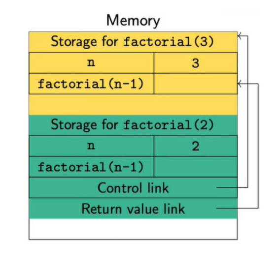
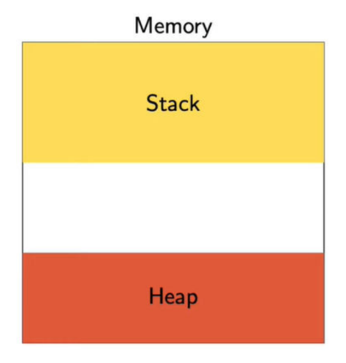

# 📅 Week 1  

## 💻 Programming Languages  

#### Lecture - 1

- A way to communicate with computers using instructions.  
- In the beginning, closely linked to how computers work internally.  
- Computers store values in memory and use registers for calculations.  
- **Basic steps:**  
  1. Load a value from memory into a register.  
  2. Perform an operation (like addition).  
  3. Store the result back in memory.  
- ⚠️ This process was complex and prone to errors.  
- 🚀 High-level languages were created to make coding easier.  

## 🧠 Abstraction in Programming  

- **What is Abstraction?**  
  - A way to simplify complex concepts in computational thinking.  

- **Common Abstractions:**  
  - Assigning values to **variables**.  
  - Using **conditional statements** (if-else).  
  - **Loops** for iteration (for, while).  
  - 🛠️ **Functions & recursion** to reuse code.  
  - 📦 **Data structures** like arrays, lists, and dictionaries.  

- **From High-Level to Low-Level:**  
  - Programming languages express these abstract ideas.  
  - 🔄 **Compilers & interpreters** translate high-level code into machine language.  
  - ⚖️ **Trade-off:** More abstraction means less control over hardware but fewer errors.  


### Styles of Programming  

#### ⚡ Imperative vs. Declarative  

| Feature             | 🏗️ Imperative Programming | 🎯 Declarative Programming |
|---------------------|--------------------------|----------------------------|
| **Focus**          | How to compute            | What the computation should produce |
| **Approach**       | Step-by-step instructions | Defines results in terms of smaller computations |
| **Usage**          | Uses loops, conditionals  | Uses functions and transformations |
| **Intermediate Variables** | Commonly used | Typically avoided |
| **Example**        | Procedural languages (C, Java) | Functional languages (Haskell, SQL) |

## Imperative vs Declarative Programming, by Example  

### 📝 Adding Values in a List  

#### 🏗️ Imperative Approach  

```python
def sum_list(l):
    sum = 0
    for x in l:
        sum += x
    return sum
```
- **Intermediate values:** `sum`, `x`  
- **Explicit iteration:** Examines each element in the list.

### 🎯 Declarative (in Python)  

```python
def sum_list(l):
    if l == []:
        return 0
    else:
        return l[0] + sum_list(l[1:])
```
- **Base case:** An empty list sums to `0`.  
- **Inductive step:** Add the first element to the sum of the rest.  
- **No extra variables used.**  

### 🏗️ Imperative Approach (Python)  

```python
def sum_square_even(n):
    sum = 0
    for x in range(n + 1):
        if x % 2 == 0:
            sum += x * x
    return sum
```
- **Uses loops and conditions** to find even numbers and square them.  
- **Can be written in a functional style** to improve reusability.  
- **Helps break the problem into smaller, reusable units of code.**  

### **Names, Types, and Values**  

- Computers store everything as `bits` (no difference between data and instructions).  
- `Types` help interpret bits as **numbers, characters, or booleans**.  
- **Type rules define:**  
  - Allowed values (e.g., `integers`, `floats`).  
  - Valid operations (e.g., `addition`, `comparison`).  
- **Strict type-checking** prevents errors:  
  - **Wrong expressions** (e.g., **dimension mismatch** in math).  
  - **Incorrect assignments** (e.g., assigning `text` to a `number` variable).  

## 🚀 Abstract Data Types & Object-Oriented Programming  

### 📦 Collections Matter  
- Examples: `📚 Arrays`, `📋 Lists`, `📖 Dictionaries`.  

### 🏗️ Abstract Data Types (ADTs)  
- A **structured collection** with a fixed interface.  
- **Example:** A `🗂️ Stack` allows only `⬆️ push` and `⬇️ pop` operations.  
- **Priority Queue** supports `➕ insert` and `❌ delete-max`.  
- Can be implemented using **sorted/unsorted lists** or a **heap**.  

### 🏛️ Object-Oriented Programming (OOP)  
- Focuses on 🔹 `data types` and their behavior.  
- Functions are called **through objects** instead of passing data.  
- **Example in Python:**  
  - `my_list.sort()`🔄 (modifies the list).  
  - `sorted(my_list)` 🆕 (returns a new sorted list).  
  
### **What's Next?** 🚀  

- Explore **programming language concepts**.  
- Learn **OOP, exception handling, concurrency, and event-driven programming**.  
- Use **Java** as the main example (**imperative + OOP**).  
- Discuss **design choices**—every language has trade-offs.  
- Understand why there are **so many languages** (and why new ones keep coming! 😆).  

#### Lecture - 2 
### 🔹 The Role of Types  

- Ensure **consistent interpretation** of binary data.  
- Define **how bits are viewed** (e.g., `integers`, `floats`, `characters`).  
- Control:  
  - **Allowed values** (range, precision).  
  - **Valid operations** (e.g., addition for numbers, not for text).  
- Help **structure computation** by defining concepts:  
  - **Example:** `Point → (Float, Float)`, `Banking → Account Types & Customers`.  
- **Catch bugs early** 🐞:  
  - Prevent **incorrect expressions** (e.g., mismatched types).  
  - Avoid **wrong assignments** (e.g., assigning text to a number).  

### 🔹 Dynamic vs Static Typing  

- Every **variable** has a **type**.  
- How is the **type** determined?  

#### 🔹 Dynamic Typing (`Python` 🐍)  
- Type is based on the **current value**.  
- Example:  
  ```python
  x = 10    # x is an `int`
  x = 7.5   # now x is a `float`
  ```
  ```c
  int x;     // `x` must always store an integer
  float a;   // `a` must always store a float
  ```

### 🔹 Static Typing Helps Catch Errors Early  

- In **dynamically typed languages** like `Python`, typos can cause subtle bugs.  
- Example:  

  ```python
  def factors(n):
      factorlist = []
      for i in range(1, n + 1):
          if n % i == 0:
              factorlst = factorlist + [i]  # ❌ Typo here! (`factorlst` instead of `factorlist`)
      return factorlist

### 🔹 Empty User-Defined Objects  

- A **linked list** is a sequence of objects of type `Node`.  
- In `Python`, an **empty linked list** is often represented by `None`.  
- Example:  
  ```python
  class Node:
      def __init__(self, value):
          self.value = value
          self.next = None

  l = None  # Represents an empty linked list

### 🔹 Types of Organizing Concepts  

- **Type synonyms** make code clearer.  
  - Example:  
    ```python
    Point2D = tuple[float, float]  # A 2D point
    Point3D = tuple[float, float, float]  # A 3D point
    ```
  - Using `Point2D` and `Point3D` improves readability ✅.  

- **Advanced types** help structure programs.  
  - Example: In **banking**, `Account` and `Customer` are **separate types**.  
  - **Deposits, withdrawals, and transfers** apply to `Account`, not `Customer`.  
  - **Updating details** applies to `Customer`, not `Account`.  

### 🔹 Static Analysis  

- **Find errors early** to save time & effort ✅.  
- **Compilers can't guarantee correctness** (Halting problem – Alan Turing).  
- **Static typing** detects errors at **compile time** 🛠️.  
  - Dynamic typing catches them **only at runtime**.  
  - Runtime checks **slow down execution** ⏳.  
- **Optimizations with static analysis** 🚀:  
  - Re-order statements for efficient reads/writes.  
  - Reuse previously computed expressions.  

### 🔹 Summary  

- **Why are types important?**  
  - Help interpret **bit sequences** in memory.  
  - Organize **code in a meaningful way** 🏗️.  
  - Allow compilers to **catch bugs early** & **optimize performance** 🚀.  

- **Automatic Type Inference** 🔍  
  - Some languages **guess types** based on usage.  
  - Example:  
    ```python
    x = 7  
    y = x + 15  # y is inferred as int
    ```
  - If types remain **consistent**, the program works smoothly ✅.  

#### Lecture - 3
### 🔹 Memory Management  

- **Keeping Track of Variables**  
  - Variables store **intermediate values** during computation.  
  - Can be **local** (inside a function) or **global** (accessible everywhere).  
  - **Dynamic data** (e.g., nodes in a list) are created at runtime.  

- **Scope of a Variable** 📌  
  - Defines **where** a variable can be used.  
  - Example: A variable `x` inside `f()` is **not available** in `g()`.  

- **Lifetime of a Variable** ⏳  
  - Defines **how long** memory is allocated.  
  - Example: `x` in `f()` exists **until** `f()` finishes running.  
  - **Hole in the Scope**: A variable **exists** but is **not accessible** in some parts of the code.  

### 🔹 Memory Stack  

- **Function Storage**  
  - Each function gets **storage** for local variables.  
  - When a function is called, an **activation record** is created.  
  - These records are **stacked** and removed when the function exits.  

- **Stack Structure** 🏗️  
  - **Control link** → Points to the previous record.  
  - **Return value link** → Stores the result of the function.  

- **Example: Calling `factorial(3)`**  
  - `factorial(3)` calls `factorial(2)`, and so on...  
  - Each call **adds a new record** on the stack.  

- **Scope of a Variable** 📌  
  - The **top activation record** holds the current function's variables.  
  - **Global variables** can be accessed by following control links.  

- **Lifetime of a Variable** ⏳  
  - Memory remains allocated **as long as it's on the stack**.  

    

### **Passing Arguments to a Function**  

- When a function is called, **arguments** are substituted for **parameters**.  
- Parameters are stored in the **activation record** of the function.  
- Works like **implicit assignment** at the start of the function.  

#### **Two Ways to Pass Arguments**  
1. **Call by Value** 📥  
   - Copies the argument's value into the parameter.  
   - **Changes inside the function do not affect the original variable**.  

2. **Call by Reference** 🔗  
   - The parameter **points to the same memory location** as the argument.  
   - **Modifications inside the function affect the original variable** (side effects).  
   - **However, the reference itself cannot be changed**.  

### **Heap** 🗂️  

- Used for **dynamic memory allocation**, outlives function execution.  
- Needed when storing data **beyond a function's scope** (e.g., linked list nodes).  
- **Heap vs Stack**:  
  - **Heap** → Persistent storage, manually managed.  
  - **Stack** → Temporary storage for function calls.  
- **Not the same as the `heap` data structure** (priority queues).  


### Managing Heap Storage 🗑️  

- **Stack variables** are automatically deallocated when a function exits.  
- **Heap storage** must be managed to avoid `dead storage` (unreachable memory).  

#### Ways to Manage Heap Memory 
1. **Manual Memory Management** (e.g., C)  
   - Programmer allocates (`malloc(...)`) and frees (`free(p)`) memory.  
   - Error-prone → Can cause `memory leaks` and `invalid accesses`.  

2. **Automatic Garbage Collection** (e.g., Java, Python)  
   - Runtime `detects and removes` unused memory.  
   - `Marks` reachable storage, `frees` unmarked memory.  
   - `Trade-off` → Easier for programmers but adds performance overhead.  

### **Summary** 📝  

- **Variables have**:  
  - **Scope** → Availability in the program.  
  - **Lifetime** → Duration of storage allocation.  

- **Memory Management**:  
  - **Stack** → Stores activation records for function calls.  
    - `Control link` → Points to previous record.  
    - `Return value link` → Stores function results.  
  - **Heap** → Stores dynamically allocated data.  
    - Outlives function execution.  
    - Requires **manual deallocation** (`free()`) or **automatic garbage collection**.  

#### Lecture - 4
### **Abstraction and Modularity: Stepwise Refinement**  

- **Break down tasks** into smaller subtasks.  
- **Refine each subtask** for better clarity.  
- **Different people** can work on separate subtasks.  

#### **Example: Print First 1000 Prime Numbers**  
1. **High-level Plan**:  
   - Create a table `p`.  
   - Fill `p` with the first 1000 primes.  
   - Print `p`.  

2. **Refined Implementation**:  
   - Declare `integer array p[1:1000]`.  
   - Loop through `k = 1 to 1000`:  
     - Assign `p[k]` the `k`th prime number.  
   - Print all values of `p[k]`.  

### **Data Refinement in a Banking Application**  

- **Core Functions**:  
  - `CreateAccount()`, `Deposit()/Withdraw()`, `PrintStatement()`.  
- **Initial Representation**:  
  - Store only **current balance** in an array.  

#### **Refinement**  
- **Enhance `PrintStatement()`** → Add `PrintTransactions()`.  
- **New Requirement** → Track transactions for each account.  
- **Impact**:  
  - Data representation changes.  
  - Other account-related functions must be updated accordingly.  

### **Modular Software Development**  

- **Divide solution into components** using **stepwise refinement**.  
- **Prototype each component** to test design.  

#### **Key Elements of a Component**  
- **Interface** → What is visible (e.g., function calls).  
- **Specification** → Expected behavior through the interface.  

#### **Improving Components**  
- Modify **internals** while keeping the **interface and behavior consistent**.  
- **Basic example**: A function  
  - **Interface** → Function header, arguments, return type.  
  - **Specification** → Expected input-output behavior.  

#### **Challenges**  
- **Writing clear specifications** → Balance **abstraction and detail**.  
- **Checking correctness is hard** (Halting problem ❌).  

### **Programming Language Support for Abstraction**  

- **Control Abstraction:**  
  - Functions & procedures **encapsulate code** for reuse.  

- **Data Abstraction:**  
  - **Abstract Data Types (ADTs):** Define values & permitted operations.  
  - **Internal details hidden**; access only through a public interface.  
  - Example: A `stack` implemented as a list should **not expose** internal elements.  

- **Object-Oriented Programming (OOP):**  
  - **Organizes ADTs in a hierarchy** with inheritance & subtyping.  
  - Allows **code reuse** through implicit implementation sharing.  

### **Summary**  

- **Breaking down complex tasks** into smaller components:  
  - **Top-down:** Refine tasks into subtasks.  
  - **Bottom-up:** Combine simple building blocks.  

- **Modular component design:**  
  - **Interface & specification** define behavior.  
  - **Prototype first** to validate design.  
  - Reimplement independently while **preserving interfaces**.  

- **Programming Language Support for Abstraction:**  
  - **Control flow:** Functions & procedures.  
  - **Data abstraction:** ADTs & Object-Oriented Programming.  

#### Lecture - 5
### **Objects**  

- **Objects = Abstract Data Types (ADTs)**  
  - Encapsulate **hidden data** with **public operations**.  
  - Interact via **methods, messages, or member functions**.  

- **Encapsulation of data & functionality:**  
  - Can represent a **single value** (e.g., a counter).  
  - Can be as complex as a **filesystem or database**.  

- **Key Features of Object-Oriented Programming:**  
  - **Abstraction** → Hide implementation details.  
  - **Subtyping** → Define hierarchical relationships.  
  - **Dynamic Lookup** → Resolve methods at runtime.  
  - **Inheritance** → Reuse & extend existing functionality.  

### **History of Object-Oriented Programming**  

- **Origin:** First introduced in `Simula` (1960s) for **event-based simulation**.  
- **Basic Simulation Pattern:**  
  1. Maintain a **queue** of events.  
  2. Simulate the **event at the front** of the queue.  
  3. Add **new events** to the queue.  

- **Challenges:**  
  - Queue must handle **multiple event types** while maintaining type safety.  
  - Need a **generic simulation operation** for different events.  
  - Avoid excessive **case-checking** in the simulation process.  

### **Abstraction in Object-Oriented Programming**  

- **Objects = Abstract Data Types (ADTs)**  
  - **Public Interface:** Defines allowed interactions.  
  - **Private Implementation:** Hidden details.  
  - Changes in implementation **should not affect** how the object is used.  

- **Data-Centric Approach:**  
  - Focus on **what data** needs to be stored & manipulated.  
  - **Stepwise refinement** affects both **code & data**.  
  - Methods are **tied to data**, making updates easier.  

### **Subtyping in Object-Oriented Programming**  

- **Problem:**  
  - A **well-typed queue** should hold values of a fixed type.  
  - But in practice, it needs to store **different types of objects**.  

- **Solution: Type Hierarchy**  
  - A **subtype** is a **specialization** of a type.  
  - **If A is a subtype of B**, then **A can be used wherever B is required**.  
  - Every object of **A is also an object of B**.  

- **Key Concept:**  
  - Think of subtypes as **subsets** → If `A ⊆ B`, then every `A` is also in `B`.  
  - If `B` has a method `f()`, every `A` object **must** support `f()`.  
  - But **A can have a different implementation** of `f()`.  

### **Dynamic Lookup in Object-Oriented Programming**  

- **Static vs. Dynamic Behavior**  
  - **Static:** Determines if a method can be called on an object (**type-checking**).  
  - **Dynamic:** Defines how the method behaves based on the object's type at runtime.  

- **Examples:**  
  - **Simulation Queue:** All events have a `simulate()` method, but each event type behaves differently.  
  - **Graphics Application:** Different shapes have a `render()` method, but each shape "knows" how to draw itself.  

- **Dynamic Lookup vs. Overloading**  
  - **Overloading:** `+` works for both `int` and `float`, but the choice is based on static type.  
  - **Dynamic Lookup:** A variable `v` of type `B` can refer to an object of subtype `A`.  
  - **Method execution depends on `A`'s implementation at runtime**, not `B`'s static type.  

### **Inheritance in Object-Oriented Programming**  

- **Reusing Implementations**  
  - Example: **Employee Hierarchy**  
    - `Employee`: Stores personal data, date of joining.  
    - `Manager`: Inherits `Employee` data and adds fields like **promotion date** and **seniority**.  

- **Subtyping vs. Inheritance**  
  - **Subtyping:** Defines relationships between interfaces (what an object can do).  
  - **Inheritance:** Defines relationships between implementations (how it works).  
  - **Rule:** A class `A` can inherit from `B` **only if** `A` is a subtype of `B`.  

- **Key Concept:**  
  - **Single hierarchy** often captures both subtyping and inheritance, but they serve different purposes.  

### **Subtyping vs. Inheritance**  

- **Deque (Double-Ended Queue)**  
  - Supports `insert-front()`, `delete-front()`, `insert-rear()`, and `delete-rear()`.  
  - Can be used to **implement** a **Stack** or a **Queue**.  

- **Inheritance Example:**  
  - `Stack` uses only `insert-front()`, `delete-front()`.  
  - `Queue` uses only `insert-rear()`, `delete-front()`.  
  - `Stack` and `Queue` **inherit** from `Deque` to **reuse implementation**.  

- **Why Stack & Queue are NOT Subtypes of Deque?**  
  - If `v` of type `Deque` points to a `Stack`, calling `insert-rear()` or `delete-rear()` is **invalid**.  
  - If `v` points to a `Queue`, calling `insert-front()` or `delete-rear()` is **invalid**.  
  - **Conclusion:** `Stack` and `Queue` are not subtypes of `Deque` because their **interfaces are incompatible**.  
  - In fact, **Deque is a subtype of both Stack and Queue** because it supports their operations.  

### **Summary**  

- **Objects** → Similar to Abstract Data Types (ADTs)  
  - Encapsulate data and functionality in a uniform way.  

#### **Key Features of Object-Oriented Programming (OOP)**  

1. **Abstraction**  
   - Public interface, private implementation (like ADTs).  

2. **Subtyping**  
   - Types arranged in a hierarchy.  
   - Objects of a subtype can be used where a parent type is expected.  

3. **Dynamic Lookup**  
   - Method implementation is determined at runtime, not compile-time.  

4. **Inheritance**  
   - Reuse of implementations from a parent type.  

#### Lecture - 6
### **Programming with Objects**  

- **Objects** → Similar to Abstract Data Types (ADTs)  
  - Encapsulate hidden data with public operations (methods).  

#### **Class vs Object**  

- **Class** → Template for a data type  
  - Defines how data is stored.  
  - Specifies public methods to manipulate data.  

- **Object** → Concrete instance of a class  
  - Each object has its own copy of local data.  
  - Methods are invoked on objects (like sending a message).  

### **Example: 2D Points**

- A **Point** has coordinates \((x, y)\).  
- Each **point object** stores its own `x` and `y` values (instance variables).  
- Access instance variables using `p.x` and `p.y`.  
- `self` refers to the current object → `self.x`, `self.y`.  

#### **Constructor in Python**  
- When creating an object, a **constructor function** initializes it.  
- In Python, the constructor is named `__init__()`.  
- The first parameter is always `self`.  

#### **Example Code**  
```python
class Point:
    def __init__(self, x, y):  # Constructor
        self.x = x
        self.y = y

p1 = Point(3, 4)
print(p1.x, p1.y)  # Output: 3 4
```
### **Adding Methods to a Class**

#### **Translation: Shift a Point**
- Updates instance variables (`x`, `y`) by shifting the point.  
- **Modifies the object state**.

```python
# Inside the Point class
def translate(self, dx, dy):
    self.x += dx
    self.y += dy
```
- Distance from the Origin
- Computes distance from (0,0).
- Does not modify object state.

```Python
# Inside the Point class
def odistance(self):
    import math
    return math.sqrt(self.x**2 + self.y**2)
```
